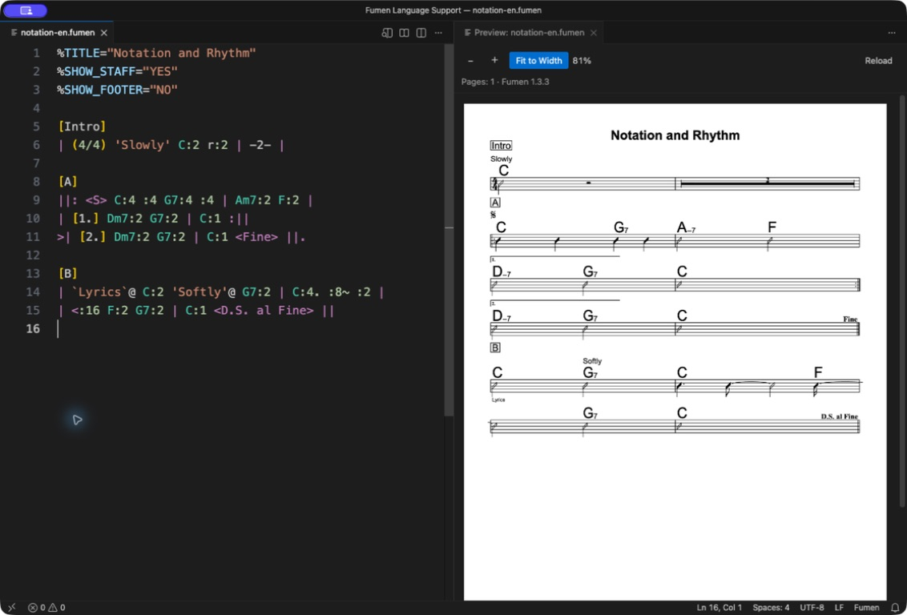

# Fumen Language Support

English | [日本語](README.ja.md)

Write [Fumen](https://github.com/hbjpn/fumen/) chord charts in VS Code with syntax highlighting, contextual completion, snippets and offline live previews. Keep English and Japanese notation guides close at hand, without chord-name suggestions getting in your way.

日本語: `.fumen` の譜面作成を、構文の色分け・設定や記号の補完・スニペット・オフラインのリアルタイムプレビューで支援します。コード名の補完は行いません。詳しくは [日本語の説明](README.ja.md)をご覧ください。

English is the default. With a Japanese VS Code display language, commands, settings descriptions, completion/hover explanations, diagnostics, preview controls and bundled help appear in Japanese. Each help document includes **日本語 / English** links, so you can read either language without changing VS Code's display language.



Edit notation and see the score beside it. Try the [English sample](examples/notation-en.fumen) shown above.

## Install

Requires VS Code **1.90 or later**. No separate Node.js, Fumen or font installation is needed to use the extension.

1. Open the Extensions view in VS Code.
2. Search for `@id:kawato3.fumen-language-support`.
3. Select **Fumen Language Support** by **Katsushi Kawato** and click **Install**.
4. Open a `.fumen` file or run **Fumen: New Score** from the Command Palette.

To install a local build instead, choose **… → Install from VSIX…** and select `fumen-language-support-1.0.1.vsix`. Version 1.0.0 can be updated in place without uninstalling it. See the development instructions below to build it yourself. If VS Code asks to reload after an update, save your work first.

If you used an earlier local build with the extension ID `fumen-local.fumen-language-support`, uninstall it before installing `kawato3.fumen-language-support` to avoid running both copies. Your `.fumen` files are unaffected.

## Features

- Syntax highlighting for settings, chords, bar lines, sections, durations, annotations and lyrics.
- Bracket/quote pairing and Tab-based snippets for common structures.
- Contextual completion for settings, fixed values, navigation signs and durations.
- A native, searchable notation picker for score structure, signs, rhythm, text and common score settings.
- Hover explanations, a direct link to the bundled cheat sheet and basic checks for malformed settings or missing delimiters.
- Live, side-by-side previews using the bundled **Fumen 1.3.3** renderer, including unsaved edits.
- An extension-specific chord-component display option in the bundled renderer: retain Fumen's compact layout or choose full-size inline symbols such as `Am7` and `AM7`. It is clearly separated from upstream Fumen settings in the [cheat sheet](docs/CHEATSHEET.md).
- Offline cheat sheets and user guides in English and Japanese, with links to the official reference.
- Conservative whitespace formatting through VS Code's standard **Format Document** command.
- A vector-friendly print view in Google Chrome, using Chrome's **Save as PDF** without a PDF library in the extension.

The extension does **not** suggest chord names, judge chord progressions or validate beat counts. Fumen word-based suggestions are disabled by default to keep arbitrary chord names from being suggested. Your settings or other extensions may override this.

## Commands and shortcuts

Open the Command Palette with `Cmd+Shift+P` on macOS or `Ctrl+Shift+P` on Windows/Linux, then search for `Fumen`:

| Command | Purpose |
| --- | --- |
| Fumen: New Score | Start an untitled score with placeholders. |
| Fumen: Insert Template | Insert bars, sections, repeats, annotations or lyrics. |
| Fumen: Insert Notation… | Search and insert Fumen notation as an editable snippet. |
| Fumen: Open Preview to the Side | Render the active Fumen document beside the source. |
| Fumen: Open Print View in Chrome | Open a snapshot for printing or saving as PDF. |
| Fumen: Open Cheat Sheet | Open an offline notation reference beside the source. |
| Fumen: Open User Guide | Open detailed usage instructions. |

The notation picker, preview and cheat sheet are also available from a Fumen editor's right-click menu. The preview and cheat sheet also have top-right buttons. Reopening the cheat sheet reuses its tab. Each document's language links work even in an English-only VS Code installation; reopening via the command follows the display language again.

The preview uses Markdown's familiar shortcut: **Cmd+K, then V** on macOS, or **Ctrl+K, then V** on Windows/Linux. Release the first keys before pressing V. It applies only while editing Fumen source text.

Other Fumen commands have no default key binding. Open **Keyboard Shortcuts** (`Cmd+K`, then `Cmd+S` on macOS; `Ctrl+K`, then `Ctrl+S` elsewhere), search for `Fumen`, and double-click a command to assign a key. User bindings override defaults; this extension never edits your `keybindings.json`.

## Format whitespace

Right-click in a Fumen editor and choose **Format Document**, or use the Command Palette. The standard shortcut is **Shift+Option+F** on macOS, **Shift+Alt+F** on Windows, and **Ctrl+Shift+I** on Linux. These are simultaneous key combinations, not the preview's two-step shortcut.

Formatting adds spaces around bar lines, reduces spaces/tabs between notation tokens to one space, removes trailing whitespace and normalizes setting assignments to `%NAME=value`. Runs of blank lines become one blank line; a single blank line is kept. Blank lines inside text/labels and immediately after a `\` line continuation are preserved, because changing them can affect the score. Other line breaks, line-ending style, indentation, chord spelling, lyrics, annotations, labels and JSON value contents are unchanged. It does not align bar columns or format a selection.

Use normal **Undo** to revert the entire format. Unclosed text delimiters cause formatting to be skipped; invalid JSON settings are left alone. Documents above 500,000 characters are not formatted.

The extension does not enable automatic formatting or change your default formatter. If you already use **Editor: Format On Save**, that setting applies to Fumen too. With multiple Fumen formatters installed, use **Format Document With… → Configure Default Formatter…** to choose one. See [VS Code's formatting documentation](https://code.visualstudio.com/docs/editing/codebasics#_formatting).

## Preview behavior and limits

The preview updates after about 300 ms without typing. It follows the document from which it was opened and supports multiple pages, zoom and fit-to-width. While the source is incomplete, the last valid image remains visible with an error message. Close the preview to stop rendering; use **Reload** if necessary.

Rendering is local and uses no network service. Source text is sent to a sandboxed webview as data, never interpolated into HTML. The bundled renderer and licenses are version/hash pinned. The A4 preset is the default; `%PARAM` can override it within safety limits.

The bundled renderer is based on Fumen 1.3.3 and has one clearly scoped extension-specific display addition: `minor_label`, `major_label` and `chord_suffix_style`. They choose chord labels and either the original compact layout or an ordinary-size inline layout for all components after a root note. These are not published Fumen 1.3.3 parameters; another Fumen tool may ignore them. The [cheat sheet's extension-specific section](docs/CHEATSHEET.md#extension-chord-display) explains the visual difference, exact defaults and portable-sharing caveat.


## Use the renderer patch outside VS Code

For another application that uses Fumen 1.3.3, the matching source patch, application instructions and example score are available in the [Fumen 1.3.3 chord component display patch](https://github.com/kawato3/fumen-language-support/tree/main/patches/fumen-1.3.3-chord-component-display) directory. It is a developer-facing source artifact and is not included in the VSIX. It must be applied to the exact documented upstream revision; it is independently maintained, not an official Fumen feature.

Limits: 100,000 source characters, 100 pages, 32 million page pixels per render and bounds on extreme rendering parameters. The renderer's retained text-measurement cache has a separate 16-million-pixel limit. Repeated changes to `%PARAM` text size or pixel ratio may fill it; close and reopen the preview to clear it. These are allocation guards, not a guarantee of total process memory or rendering time. Basic editor diagnostics stop above 500,000 characters. Split unusually large scores into smaller files.

Editing by clicking the score and synchronized source/preview scrolling are not included. Upstream renderer error details are shown as received, while the extension's own messages follow the display language.

## Print or save as PDF

Requires **Google Chrome** and **local desktop VS Code**. Chrome is needed only for printing; it is not bundled. Remote SSH, WSL, containers and browser-based VS Code are not supported for this feature.

1. Choose **Fumen: Open Print View in Chrome** from the Command Palette or the Fumen editor's right-click menu. You can also use **Print / PDF** in a successfully rendered preview.
2. Wait for the print view to finish loading, then click **Print / Save as PDF**.
3. In Chrome, choose **Save as PDF**, **A4**, **no margins**, and turn **headers and footers off**. Choose where to save the PDF yourself.

The page is a snapshot of the source, including unsaved edits. Editing in VS Code does not update an already-open print page: open a new one after changes. Invalid scores do not fall back to an older preview image. Custom Fumen page sizes are fitted proportionally inside A4.

The adapter records Fumen's Canvas drawing commands and replays them synchronously for Chrome's print capture. This preserves vector notation and searchable text where Chrome and the available fonts support them; it does not convert to SVG or add invisible text over a bitmap. Search and font behavior can vary by browser version and OS. Short scores may be larger than image-based PDFs because of embedded fonts. The normal rendering limits apply, with an additional drawing-complexity limit.

Rendering uses only bundled assets, without uploading the score. The extension launches Chrome without a shell and creates private local HTML snapshots in its VS Code storage. These contain the source text and third-party notices. They are removed when the extension shuts down; after a crash, snapshots older than 24 hours are removed on the next print request. Save the PDF before closing VS Code. Your own Chrome extensions, browser settings and chosen print destination remain outside this extension's control.

If Chrome is installed in a nonstandard location, set `fumen.print.chromePath` to its executable's absolute path in **User Settings**. This machine-only setting does not accept command-line arguments or workspace overrides. Printing has no default shortcut; you may assign one in Keyboard Shortcuts.

## Settings and snippets

- `fumen.diagnostics.enabled`: enable basic setting/delimiter checks (default: true).
- `fumen.diagnostics.delay`: milliseconds after typing stops (default: 700; range: 200–5000).
- `fumen.print.chromePath`: optional absolute Chrome executable path (default: detect a standard installation).

Snippets use English names and stable `fumen-` prefixes in all display languages: `fumen-new`, `fumen-4bars`, `fumen-8bars`, `fumen-section`, `fumen-repeat`, `fumen-endings`, `fumen-note`, `fumen-lyric`. Use **Snippets: Insert Snippet** or invoke completion manually. Template placeholders and notation examples stay in English; existing score content is never translated.

## Development and distribution

Building requires Node.js 22 or later:

```sh
npm ci
npm run check
npm run test:integration
npm run test:print
npm run package
```

Normal builds verify bundled assets locally; `npm run vendor:fumen` restores missing assets from pinned upstream URLs. Tests cover notation support, rendering safety, actual VS Code previews and localization. `test:print` uses an installed Chrome with isolated contexts; it does not download a browser. See the [development guide](docs/DEVELOPMENT.md) (Japanese) for isolated test profiles and specific VS Code versions.

Static contributions use `package.nls.json` and `package.nls.ja.json`; runtime strings use VS Code's `l10n` API and `l10n/bundle.l10n.ja.json`. English is the fallback. The extension follows VS Code's display language, not OS locale or document contents, and never changes the user's language settings.

The registered Marketplace publisher is `kawato3`; the extension ID is `kawato3.fumen-language-support`. Follow the [publishing guide](docs/PUBLISHING.md) (Japanese) before publication. `npm run check:publish` checks basic metadata but does not publish. `private: true` prevents npm publication, not Marketplace publication.

## Feedback

Report bugs and request features through [GitHub Issues](https://github.com/kawato3/fumen-language-support/issues). English and Japanese are both welcome. For bug reports, include your VS Code and extension versions and a small example you can share publicly.

## License and acknowledgments

MIT License — Copyright (c) 2026 Katsushi Kawato. See [LICENSE](LICENSE) for the full terms.

This is an independent extension, not an official Fumen product. Rendering is provided by [hbjpn/fumen](https://github.com/hbjpn/fumen/), created by Hiroyuki Baba. Bundled third-party code, documentation and music symbols retain their own MIT/OFL licenses and copyright notices; see [third-party notices](THIRD_PARTY_NOTICES.md) and [bundled licenses](media/vendor/).

## Changelog

### 1.0.2

- Added extension-specific chord component display parameters: `minor_label`, `major_label`, and `chord_suffix_style`. Choose custom minor/major labels and either Fumen’s compact layout or a full-size inline layout.

### 1.0.1

- Initial Marketplace release of Fumen Language Support.
