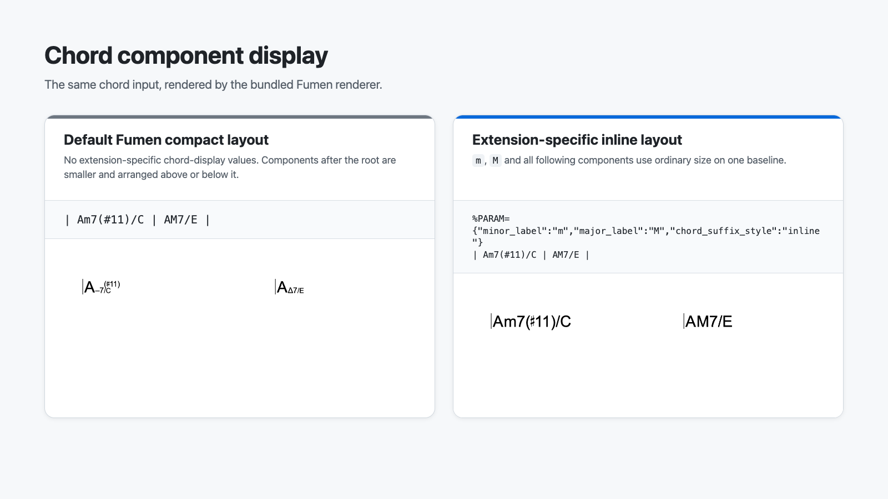

# Fumen Language Support — User Guide

English | [日本語](QUICKSTART.ja.md)

This extension helps you write `.fumen` chord-chart files. It assists with notation and settings, without suggesting chord names or checking musical choices.

## 1. Install or update

1. In VS Code, open the Extensions view.
2. Search for `@id:kawato3.fumen-language-support`.
3. Select **Fumen Language Support** by **Katsushi Kawato** and click **Install**.
4. If VS Code asks to reload, save any unsaved work first.

Open the Command Palette with `Cmd+Shift+P` on macOS or `Ctrl+Shift+P` on Windows/Linux. Search for `Fumen` to see the extension's commands.

Manage updates from the Extensions view. For a local build, choose **… → Install from VSIX…** and select the `.vsix` file; install newer local builds in the same way. If you used the earlier `fumen-local.fumen-language-support` extension, uninstall that copy first to avoid running both versions. Your score files are unaffected.

## 2. Start a score

Run **Fumen: New Score**. Fill in the title and artist, then press Tab to move through the placeholders. Save the document with a `.fumen` extension. The language indicator in the bottom-right corner should read **Fumen**.

```fumen
%TITLE="Practice"
%ARTIST=""
%SHOW_FOOTER="NO"

[A]
| (4/4) C | Am7 | F | G7 |
| C | Am7 | Dm7 G7 | C ||.
```

## 3. Completion and explanations

- Type `%` at the start of a setting to see setting names.
- Known fixed values, such as `"YES"` and `"NO"`, have completion choices.
- Inside a measure, `<` offers navigation signs and `:` offers durations.
- Hover over a setting or symbol to read its explanation and a link to the official reference.
- Use **Trigger Suggest** (`Ctrl+Space`, including on macOS) for manual completion. If the operating system intercepts it, run that command from the Command Palette or assign another key.

Chord names, keys and free-form text are not suggested. The extension also disables word-based suggestions for Fumen by default to avoid guessing chords from other parts of the song. Other extensions or user settings can override this behavior.

## 4. Templates and snippets

Run **Fumen: Insert Template** for four/eight bars, sections, repeats, endings, annotations or lyrics. Tab and Shift+Tab move between placeholders; Escape ends placeholder navigation.

The bundled snippets use stable English names and `fumen-` prefixes in every display language. Run **Snippets: Insert Snippet** and choose a Fumen snippet, or type a prefix such as `fumen-4bars` and invoke completion. These templates insert text only; they do not change existing music automatically.

## 5. Live preview

Click the preview button at the top-right of a Fumen editor, or run **Fumen: Open Preview to the Side**.

The editor's right-click menu also includes **Open Preview to the Side** and **Open Cheat Sheet**.

- Edits appear after roughly 0.3 seconds without typing; saving is not required.
- Use **+**, **−** and **Fit to Width** to adjust the display without changing the source.
- If incomplete notation cannot be rendered, the previous valid image remains with an explanation. Fixing the source updates it again.
- The preview follows the score from which it was opened. To view another score, open its preview from that editor.
- Closing the preview stops rendering. After closing, renaming or replacing the source document, reopen the preview.
- Use **Reload** if rendering does not resume after correcting the source.

The bundled renderer is based on Fumen 1.3.3 and works offline, with no extra font installation. The default paper preset is A4; `%PARAM` takes precedence when specified. It also has an extension-specific chord-component display addition: `minor_label`, `major_label` and `chord_suffix_style` can select compact or ordinary-size inline chord symbols. These are not published Fumen 1.3.3 parameters and other Fumen tools may ignore them; see the separate [extension-specific cheat-sheet section](CHEATSHEET.md#extension-chord-display) before using them in shared scores.



Limits are 100,000 characters, 100 pages and 32 million page pixels per render, with additional guards for extreme rendering parameters. A separate text-measurement cache is limited to 16 million pixels. If changing `%PARAM` text_size or pixel_ratio fills that cache, close and reopen the preview. Large scores may update slowly; these limits do not bound total process memory or execution time. Direct editing on the score and synchronized source/preview scrolling are not provided.

## 6. Look up notation

Click the book button at the top-right of a Fumen editor or run **Fumen: Open Cheat Sheet**. The [cheat sheet](CHEATSHEET.md) opens beside your source and works offline. You can copy notation examples and follow links to the official website for more detail.

Running the command again reuses the existing tab. If the score preview occupies the adjacent group, the cheat sheet opens as another tab in that group. It does not follow other Markdown documents that you edit.

The cheat sheet and this guide open in Japanese when VS Code's display language is Japanese; all other display languages use English. Commands, settings descriptions, completion/hover explanations, diagnostics and preview controls follow the same policy. The OS language and the score's contents do not determine the language.

The **日本語** / **English** links at the top let you switch documents without installing a language pack or changing VS Code's language. Opening help from its command again follows the editor's display language. Restart VS Code after changing its display language.

## 7. Keyboard shortcuts

The preview uses the same default shortcut as VS Code's Markdown preview. Focus the Fumen source editor first:

- macOS: press `Cmd+K`, release the keys, then press `V`.
- Windows/Linux: press `Ctrl+K`, release the keys, then press `V`.

These are sequential keystrokes, not one simultaneous combination. Do not hold Cmd/Ctrl for the second `V`.

Other Fumen commands, including the cheat sheet, have no default shortcut. To assign your own:

1. Open **Keyboard Shortcuts**: `Cmd+K`, then `Cmd+S` on macOS; `Ctrl+K`, then `Ctrl+S` on Windows/Linux.
2. Search for `Fumen`. For a specific command, search `@command:fumen.openCheatSheet` or `@command:fumen.openPreview`.
3. Double-click the command, press your preferred keys, and press Enter.
4. Check for conflicting assignments before using the shortcut.

User assignments override defaults. Installing this extension never edits your `keybindings.json`.

## 8. Format whitespace

Right-click the Fumen source and choose **Format Document**, or find that standard command in the Command Palette. Its default shortcut is `Shift+Option+F` on macOS, `Shift+Alt+F` on Windows, or `Ctrl+Shift+I` on Linux; press these keys together.

The formatter spaces bar lines, reduces gaps between notation tokens to one space, removes trailing whitespace and normalizes `%NAME=value` assignments. Consecutive blank lines become one blank line; a single blank line is kept. Blank lines inside text/labels and immediately after a `\` line continuation are left alone to preserve the score's structure. Other line breaks, line-ending style, indentation, chord spelling, lyrics, annotations, labels and JSON value contents stay unchanged. Bar-column alignment and selection formatting are not included. Use **Undo** once to revert the format.

Unclosed text delimiters and documents above 500,000 characters are skipped; invalid JSON settings are left alone. The extension does not turn on automatic formatting. Your existing **Editor: Format On Save** setting is respected; if multiple formatters are installed, choose this extension through **Format Document With… → Configure Default Formatter…**. To change the shortcut, search Keyboard Shortcuts for `@command:editor.action.formatDocument`.

## 9. Print or save as PDF

Install Google Chrome and use local desktop VS Code. Choose **Fumen: Open Print View in Chrome** from the Command Palette or the Fumen editor's right-click menu, or click **Print / PDF** in a successfully rendered preview.

In Chrome, wait for the score, click **Print / Save as PDF**, and select **Save as PDF**, **A4**, **no margins**, with **headers and footers off**. Choose a PDF filename and save it. The PDF preserves vector drawing and searchable text where Chrome and your fonts support them. Short scores can be larger due to embedded fonts.

Unsaved source edits are included, but the page does not update afterward. Reopen it after editing. Invalid input does not print the last valid preview. Custom Fumen page dimensions fit proportionally inside A4. Printing has the preview's safety limits plus a drawing-complexity limit. There is no default print shortcut; assign one by searching for `Fumen` in Keyboard Shortcuts.

The local HTML snapshot contains your source and bundled assets; the extension does not upload it. It is removed when the extension closes, or, after a crash, on the next print request once it is more than 24 hours old. Save the PDF before closing VS Code. Chrome's own extensions and the chosen print destination are outside this extension's control.

Chrome is required only for this feature. If it cannot be found, use **Fumen: Print Chrome Path** in User Settings to specify the executable's absolute path (no arguments). Workspace overrides are ignored. Remote SSH, WSL, containers and browser-based VS Code are not supported for printing: open the source locally instead.

## Troubleshooting

- **No highlighting or editor buttons:** check that the language indicator says Fumen. After an update, save your work and run **Developer: Reload Window**.
- **No symbol completion:** check that `editor.suggestOnTriggerCharacters` is enabled, or invoke **Trigger Suggest** manually.
- **Unwanted chord suggestions:** check Fumen's `editor.wordBasedSuggestions` setting and other installed extensions.
- **Unwanted diagnostics:** search for `Fumen` in Settings and disable **Diagnostics: Enabled**. Checks are deliberately limited to settings and delimiters, not musical correctness.
- **Help will not open:** enable VS Code's built-in **Markdown Language Features**. The cheat-sheet error message also offers to open the official website in a browser.
- **Preview shortcut does not work:** focus the Fumen source text, press the keys in sequence, and check for conflicts in Keyboard Shortcuts.

[Official Fumen documentation](https://hbjpn.github.io/fumen/)
